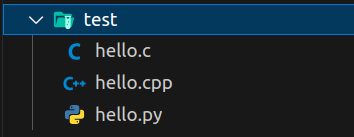

# Configuring Workspace

Lately I have needed to format several computers and I always start by doing all my user configuration and then installing the applications. That's why I developed this shell script to run whenever I need to change computers, so I always have my programs installed and my environment updated.

---

### Description

Currently the script installs the following programs such as Chrome, VScode (with all my personal settings), Python and other essential packages.

This script **was developed to run on Ubuntu**, more specifically on version **22.02 LTS,** but one day I will create new versions to cover other OS.

I used ShellCheck to check the scripts for errors:

- [ShellCheck](https://www.shellcheck.net/)

I used the following documentation to learn Bash Shell:

- [Ryans Tutorials](https://ryanstutorials.net/bash-scripting-tutorial/)

- [GNU Bash Manual](https://www.gnu.org/software/bash/manual/)

---

### Download and Installation

1. Cloninig the repostory

```git
git clone https://github.com/renanss4/configuring-workspace.git
```

2. Going to the project

```bash
cd ./configuring-workspace
```

3. Giving permissions

```bash
chmod +x install.sh
```

4. Run

```bash
./install.sh
```

---

### Testing

If everything went well, now it's time to test :)

1. Open VScode

```bash
code .
```

2. Find the following files

   

3. Run Code Runner

   

If they were printed and compiled, then everything went well :)

---

### Next steps

1. Cover other OS

2. Create environment for Data Science
   
   - Using requirements.txt
   
   ```python
   pip3 install -r requrements.txt
   ```

3. Improve documentation and scripting
